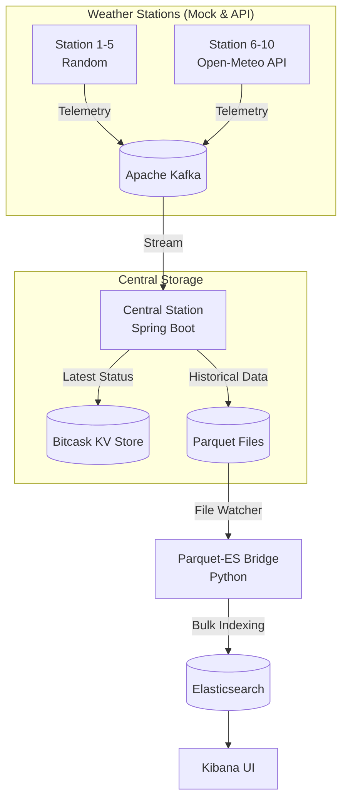

# Distributed Weather Observability Platform

A distributed IoT weather monitoring system built with Kafka, Java, Spring Boot, Python, and Kubernetes. The platform simulates real-time weather stations streaming data through a data-intensive pipeline including stream processing, Bitcask key-value storage, Parquet archiving, and Elasticsearch/Kibana analytics.

## 🏗 Architecture Overview



---

## 🚀 Running Guide: Docker Compose (Local Development)

The Docker Compose setup is the easiest way to run the system locally for development and testing.

### Prerequisites
- Docker & Docker Compose installed
- At least 4GB of RAM allocated to Docker

### Starting the System
1. Open a terminal in the project root.
2. Run the full stack:
   ```bash
   docker compose up --build -d
   ```
3. Wait for all services to become healthy (Kafka and Elasticsearch take a moment).
   ```bash
   # Check logs and status
   docker compose ps
   docker compose logs -f
   ```

### Accessing the Interfaces
- **Kibana (Analytics):** http://localhost:5601
- **Kafka UI (Message Broker):** http://localhost:8080
- **Central Station API:** http://localhost:3000

### Stopping the System
```bash
docker compose down -v
```

---

## ☸️ Running Guide: Kubernetes (Minikube Production-Like)

The Kubernetes setup mirrors a production environment using Minikube.

### Prerequisites
- Minikube installed
- `kubectl` installed
- **Crucial:** System must have at least **10 CPUs** and **8GB RAM** available for Minikube.

### Starting the System
1. **Initialize Minikube with required resources:**
   ```bash
   minikube start --cpus=10 --memory=8192 --driver=docker
   
   # Optional: save these as defaults for future runs
   minikube config set cpus 10
   minikube config set memory 8192
   ```

2. **Run the deployment script:**
   The `deploy.sh` script automatically builds local images into Minikube and applies all manifests in the correct order.
   ```bash
   ./k8s/deploy.sh
   ```
   *(Note: The first run takes several minutes because it must pull the 1.2GB Elasticsearch image).*

### Accessing the Interfaces
Because Minikube runs in a VM/container, you cannot use `localhost`. Use `minikube service` to get the exposed URLs:

```bash
minikube service kibana -n weather --url
minikube service kafka-ui -n weather --url
minikube service elasticsearch -n weather --url
```

### Stopping & Cleanup
```bash
# Delete all resources in the weather namespace
./k8s/deploy.sh --delete

# Stop minikube entirely
minikube stop
```

---

## 📚 Documentation
For more detailed information on specific components, check the `docs/` folder:
- [Central Station & Bitcask](docs/CENTRAL.md)
- [Kubernetes Operations](docs/KUBERNETES.md)
- [Parquet-Elasticsearch Bridge](docs/PARQUET_ES_BRIDGE.md)
